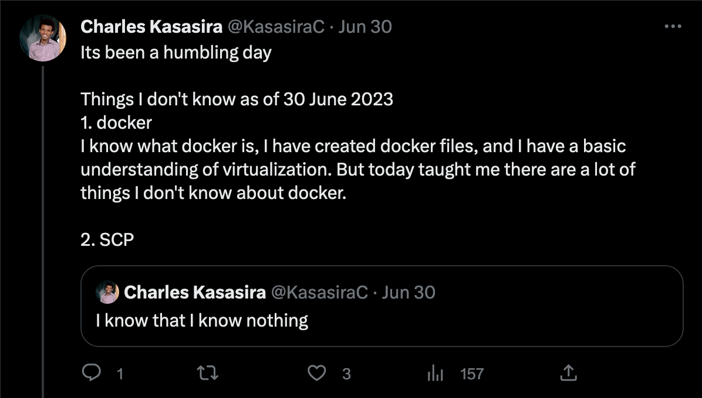
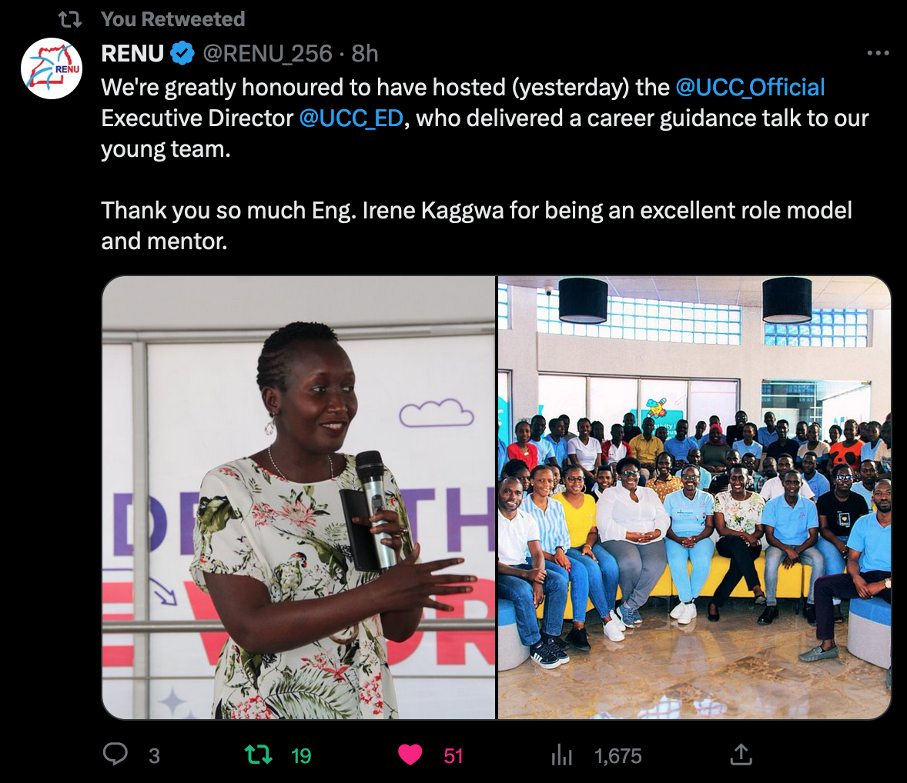

# RENU Industrial Training Program 2023

This is the detailed log of the things (mostly technical) I got to learn during my internship with RENU (Research and Education Network for Uganda). RENU is Uganda's National Research and Education Network (NREN).

### Week 1

#### Monday: Introduction

- RENU history
- RENU Ecosystem
- RENU operations

#### Tuesday: Goals of the Industrial Training Program

- Assigned to the Technical Department (NOC, systems, and software)

#### Wednesday: Public Holiday

- [Eid al-Adha](https://en.wikipedia.org/wiki/Eid_al-Adha)

#### Thursday: Pre-requisite Software

- VMs
  - Got to learn that Virtualbox(from oracle) and VMware(from VMWare inc) are different virtualization software
- Install Debian and windows server 2019 on VMS

#### Friday: SSH key-based authentication on a Linux server

- ssh
- Public vs private keys
- Read about RSA

#### WEEK 1 SUM UP

### Week 2

#### Monday: OS & VCS

#### Tuesday: Virtualization & Containerization

#### Wednesday: Set up Pi-hole

[Pi-hole](https://pi-hole.net/) is a Linux network-level ad and Internet tracker blocking application that acts as a DNS sinkhole and optionally a DHCP server, intended for use on a private network

#### Thursday: Active Directory on Windows Server. Project

#### Friday: Active Directory

#### WEEK 2 SUM UP

Project Terms and Breakdown

### WEEK 3

#### Monday: Project Brainstorm

#### Tuesday: Layer-2 switch functions

#### Wednesday: VLANS

#### Thursday: TCP/IP

#### Friday: Technical Department Meeting

### WEEK 4

#### Monday: Routing and Routed Protocols

#### Tuesday: Configuring Router and Switch using Packet Tracer

#### Wednesday: Visited RENU's Data Center

#### Thursday: Wireless Concepts

#### Friday: Career Talk from ED UCC

