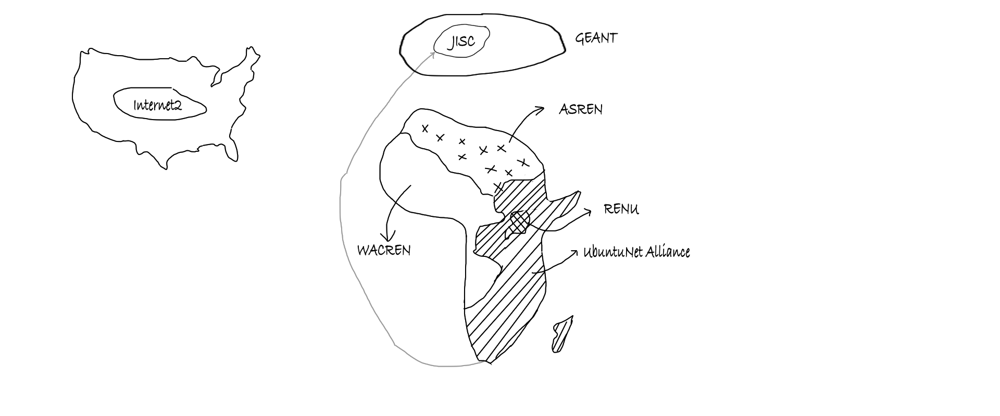

# RENU Industrial Training Program 2023

This is the detailed log of the things (mostly technical) I got to learn during my internship with RENU (Research and Education Network for Uganda). RENU is Uganda's National Research and Education Network (NREN). You can see the Summarised Table of my time at RENU [here](https://github.com/charleskasasira/charleskasasira).

### Week 1 (26th - 30th June)

#### Monday: Introduction



- RENU history
  - 2006: the birth of RENU
  - 2010: UCC License
- RENU Ecosystem
  - Global
  - RREN - UbuntuNet Alliance
  - NREN - RENU
- RENU operations
  - [RENU board](https://renu.ac.ug)
  - RENU secretariat
  - Service: eduroam, eduVPN, Web hosting, Cloud, turnitin, etc

#### Tuesday: Goals of the Industrial Training Program

- To deepen my technical Skills
- Get to apply the theoritical knowledge from Campus
- Meet and learn from experts in the field
- Assigned to the Technical Department (Networking, systems, and software)

#### Wednesday: Public Holiday

- [Eid al-Adha](https://en.wikipedia.org/wiki/Eid_al-Adha)

#### Thursday: Pre-requisite Software

- VMs
  - `Ah ha!` Got to learn that Virtualbox(from oracle) and VMware(from VMWare inc) are different virtualization software. It now sounds obvious.
- Install Debian and windows server 2019 on VMS

#### Friday: SSH key-based authentication on a Linux server

- ssh
  - SSH supports 2 forms of authentication `Password` and `Public key`. `Public-key` is more secure. I had to disable Password Authentication on the VMs.
  - Wrote a script to generate ssh keys
  ```sh
  #!/bin/bash
  # Set the file path for the SSH key pair
  key_path="$HOME/.ssh/id_rsa"
  # Generate an RSA key pair without a passphrase
  # -t rsa: Specifies the key type as RSA
  # -f "$key_path": Specifies the file path and name for the key pair
  # -q: Enables quiet mode, suppressing unnecessary output
  # -P "": Sets an empty passphrase
  ssh-keygen -t rsa -f "$key_path" -q -P ""
  echo "SSH key pair generated successfully."
  ```
- Public vs private keys
- Read about RSA

#### WEEK 1 SUM UP


<hr />

### Week 2 (3rd - 7th July)

#### Monday: OS & VCS

#### Tuesday: Virtualization & Containerization

#### Wednesday: Set up Pi-hole


[Pi-hole](https://pi-hole.net/) is a Linux network-level ad and Internet tracker blocking application that acts as a DNS sinkhole and optionally a DHCP server, intended for use on a private network

#### Thursday: Active Directory on Windows Server. Project

#### Friday: Active Directory

#### WEEK 2 SUM UP

Project Terms and Breakdown

### WEEK 3 (10th - 14th July)

#### Monday: Project Brainstorm

#### Tuesday: Layer-2 switch functions

#### Wednesday: VLANS

#### Thursday: TCP/IP

#### Friday: Technical Department Meeting

### WEEK 4 (17th - 21th July)

#### Monday: Routing and Routed Protocols

#### Tuesday: Configuring Router and Switch using Packet Tracer

#### Wednesday: Visited RENU's Data Center

#### Thursday: Wireless Concepts

#### Friday: Career Talk from ED UCC


### WEEK 5 (24th - 28th July)
