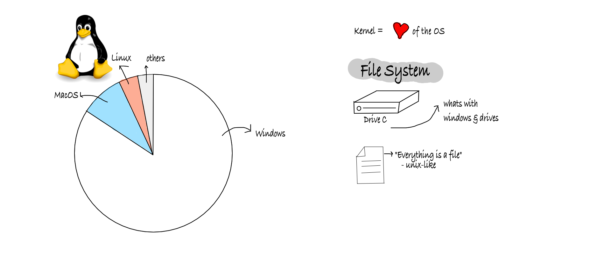

# RENU Industrial Training Program 2023

This is the detailed log of the things (mostly technical) I got to learn during my internship with RENU (Research and Education Network for Uganda). RENU is Uganda's National Research and Education Network (NREN). You can see the Summarised Table of my time at RENU [here](https://github.com/charleskasasira/charleskasasira).


### <a name="week-1-26th-30th-june"></a>Week 1 (26th - 30th June)

#### Monday: Introduction


- RENU history
  - 2006: the birth of RENU
  - 2010: UCC License
- RENU Ecosystem
  - Global
  - RREN - UbuntuNet Alliance
  - NREN - RENU
- RENU operations
  - [RENU board](https://renu.ac.ug/governance.html)
  - RENU secretariat
  - [Service](https://renu.ac.ug/services.html): RENU Identity Federation, Connectivity, eduroam, eduVPN, Web hosting, Cloud, turnitin, etc

#### Tuesday: Goals of the Industrial Training Program

- To deepen my technical Skills
- Get to apply the theoritical knowledge from Campus
- Meet and learn from experts in the field
- Assigned to the Technical Department (Networking, systems, and software)

#### Wednesday: Public Holiday

- [Eid al-Adha](https://en.wikipedia.org/wiki/Eid_al-Adha)

#### Thursday: Pre-requisite Software

- VMs
  - `Ah ha!` Got to learn that Virtualbox(from oracle) and VMware(from VMWare inc) are different virtualization software. It now sounds obvious.
- Install Debian and windows server 2019 on VMS

#### Friday: SSH key-based authentication on a Linux server

- SSH

  - SSH supports 2 forms of authentication `Password` and `Public key`. `Public-key` is more secure. I had to disable Password Authentication on the VMs.

    `#PasswordAuthentication no`

  - Wrote a script to generate RSA ssh keys

  ```sh
  #!/bin/bash
  # Set the file path for the SSH key pair
  key_path="$HOME/.ssh/id_rsa"
  # Generate an RSA key pair without a passphrase
  # -t rsa: Specifies the key type as RSA
  # -f "$key_path": Specifies the file path and name for the key pair
  # -q: Enables quiet mode, suppressing unnecessary output
  # -P "": Sets an empty passphrase
  ssh-keygen -t rsa -f "$key_path" -q -P ""
  echo "SSH key pair generated successfully."
  ```

- Public vs private keys
- Read about RSA

  RSA (Asymetric Encryption Algorithm)
  Its security lies in the difficulty of factoring [semi prime numbers\*][id1]

  [id1]: ## "prime numbers whose factors are prime."

  

  ##### Sharing Files from local to remote using scp
  `SCP` is a command-line tool in Linux used to securely transfer files between local and remote systems over a secure SSH (Secure Shell) connection. It allows users to copy files and directories securely between different hosts without the need for additional setup or software.

  ```shell
  $ scp filename charles@remote_ip:/home/charles/
  ```

#### WEEK 1 SUM UP


<hr />

### <a name="week-2-3rd-7th-july"></a>Week 2 (3rd - 7th July)

#### Monday: Operating System & Version Control System

###### Operating Systems



- Unix, BSD, Linux (Unix like / \*nix/ POSIX)
- Files Systems
- The linux Distribution Timeline

I got to look at the linux Distro timeline, got to learn of the `Debian` branch with some of the common Operating systems including `Ubuntu`, `Kali`, `Tails`

- `Minix` (Mini Unix) - unix-like Os based on a microkernel architecture

#### Linux Commands Operators

| Operator | Description                                                                                                                        |
| -------- | ---------------------------------------------------------------------------------------------------------------------------------- |
| `&`      | allows you to run commands in the background of you terminal                                                                       |
| `&&`     | allows you to combine multiple commands together in one line of your terminal                                                      |
| `;`      | execute commands in order. difference with `&&` is that it will execute next command even if the previous command was unsuccessful |
| `>`      | is a redirector - can take the output from a command and dirrect it elsewhere                                                      |
| `>>`     | same function as `>` but appends the output rather than replacing                                                                  |
| `\|`     | allows you to redirect the output of one command as the input to another command                                                   |
| `\|\|`   | execute the next command if the first one fails                                                                                    |
| `{..}`   | group commands                                                                                                                     |

#### Unix Timeline


###### Version Control

#### Tuesday: Virtualization & Containerization


Types of Virtualization

- Desktop
- Network
- Storage
  - Network Attached Storage (NAS) and Storage Area Network (SAN)

##### Week's Tasks: Automaticon

RENU runs hundreds of VMs for its members, how can you automate the process of installing the OS. how to provision a VM at the push of the button.

#### Wednesday: Set up Pi-hole


[Pi-hole](https://pi-hole.net/) is a Linux network-level ad and Internet tracker blocking application that acts as a DNS sinkhole and optionally a DHCP server, intended for use on a private network

#### Thursday: Active Directory on Windows Server. Project

#### Friday: Active Directory

#### WEEK 2 SUM UP

Talk from Dr. Ivan Walulya


Talk from Brook


### <a name="week-3-10th-14th-july"></a>WEEK 3 (10th - 14th July)

#### Monday: Project Brainstorm

##### Day in the life of a SOC (Security Operation Centre) Analyst

Knowledge Areas

- Networking
- Malware analysis
- Incident analysis
- Cyber etiquette

Mainly daily tasks: Monitor and analyze the network

##### 3 Levels of SOC anaylst

- L1: focus alert triaging
- L2: typically handle escalated threats
- L3: Escalations from L2

#### Monday: OSI Layers, Layer 1


#### Tuesday: Layer-2 switch functions

#### Wednesday: VLANS

`(session with Clinton)`

#### Thursday: TCP/IP

#### Friday: Technical Department Meeting

### <a name="week-4-17th-21th-july"></a>WEEK 4 (17th - 21th July)

#### Monday: Routing and Routed Protocols


##### Loopback Address


#### Tuesday: Configuring Router and Switch using Packet Tracer

#### Wednesday: Visited RENU's Data Center

`(session with Arthur)`


**Google Cache**: in RENU's data center to store and deliver cached content for faster access.

**ODF (Optical Distribution Frame)**: provides centralized location for the termination, splicing, interconnection of optical fibres.

#### Thursday: Wireless Concepts

`(session with Nicholas Brain)`

Telecommunication = Distant communication

**SSID (Service Set Identifier)**: a unique name that identifies a specific Wi-Fi network.

**ISM (Industrial, Scientific, Medical bands)**

```
band = collection of frequencies
```

#### Friday: Career Talk from ED UCC


### <a name="week-5-24th-28th-july"></a>WEEK 5 (24th - 28th July)

#### Thursday: Automation

##### Ansible

##### Scripting

##### Cronjobs

> cron = chronos (Greek for time)

A cron is a time-based job scheduler in unix-like OS.

Why cron:

- System maintence
- Backups
- Data synchronization
- Report generation
- more...

Crontab (Cron Table) - reads a configuration file.

` $: 0 7 * * * curl http://charleskasasira.me/send_good_morning_sms/`

#### Friday: Packet Tracer


### <a name="week-6-31st-4th-august"></a>WEEK 6 (31st July - 4th August)

#### Monday: Network Monitoring and Management

- Cacti
- LibreNMS
- Nagios

#### Tuesday: HelpDesk & NfSen

#### Wednesday: Microwave Links & Eduroam on the Go

`(session with Nicholas Brian)`

#### Thursday: Project Reviews

#### Friday: GitHub Actions & Testing and Code Quality


### <a name="week-7-7tht-11th-august"></a>WEEK 7 (7th - 11th August)

#### Monday: DNS, Webhooks
A centrally-maintained file, distributed to all host on the internet was the first solution of DNS. We still have the `/etc/hosts` - local DNS.
- The disadvantage with this is that it doesn't scale.

##### DNS Herarchy
- Root Server
- .ug
- .ac.ug
- renu.ac.ug Authoritative server

Currently `.ug` and `ac.ug` server is run by `I3C`, owned by `Charles Musis`

#### Tuesday: Logs, Cron tasks and Backup

#### Wednesday: Routing Games

`(session with Brian)`

#### Thursday: Configuring DNS using `bind` & Project Review

#### Friday: Server Management (Configurations)
`(session with Derrick)`
##### Qemu/KVM Virtual Machines - PROXMOX
QEMU (short form for Quick Emulator) is an open source hypervisor that emulates a physical computer. 


Proxmox Virtual Environment is a complete, open-source server management platform for enterprise virtualization. It tightly integrates the KVM hypervisor and Linux Containers (LXC), software-defined storage and networking functionality, on a single platform.

