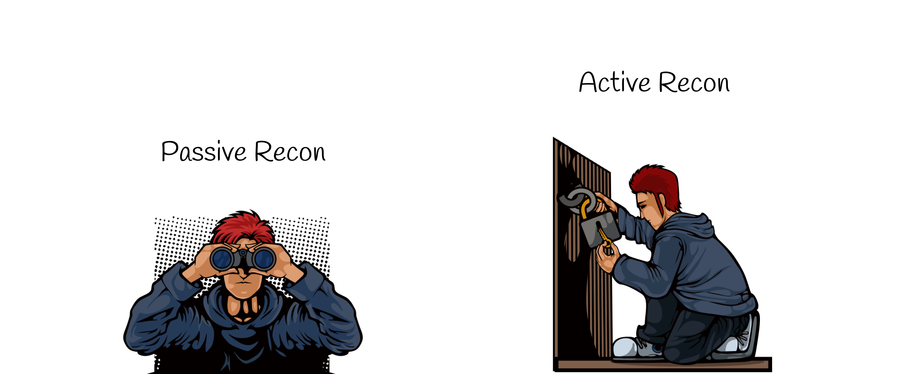

### Gobuster
Written in the Go language, this tool enumerates hidden files along with the remote directories.

```
gobuster -u url -w /path/to/wordlist

gobuster dir -u url -w /path/to/wordlist
```
