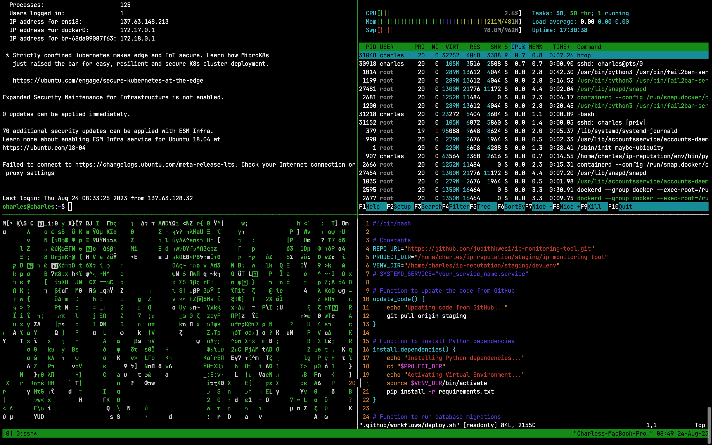

# For FUN is a valid reason

```markdown
Most of the good programmers do programming not because they expect to get paid or get adulation by the public,
but because it is FUN to program.

`Linus Torvalds`
```


